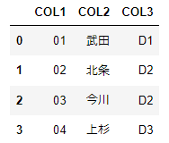
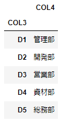

# データフレーム同士の外部結合
データフレーム1とデータフレーム2を外部結合する

<br>

## データフレーム(1)を表示
```
frame1
```


<br>

## データフレーム(2)を表示
```
frame2
```


<br>

## データフレーム同士の外部結合
```
main = pd.merge(frame1, frame2, how='left', on='COL3')
```

<br>

## 結合済みのデータフレーム表示
```
main
```

