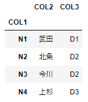
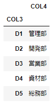
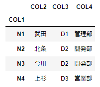

# データフレーム同士の外部結合
データフレーム(1)とデータフレーム(2)を外部結合する

<br>

## データフレーム(1)を表示
```
frame1
```


<br>

## データフレーム(2)を表示
```
frame2
```


<br>

## データフレーム同士を左外部結合して新しいデータフレーム作成
```
main = pd.merge(frame1, frame2, how='left', on='COL3')
```

<br>

## 作成したデータフレームに索引を指定
```
main.set_index('COL1')
```

<br>

## 結合済みのデータフレーム表示
```
main
```


<br>
